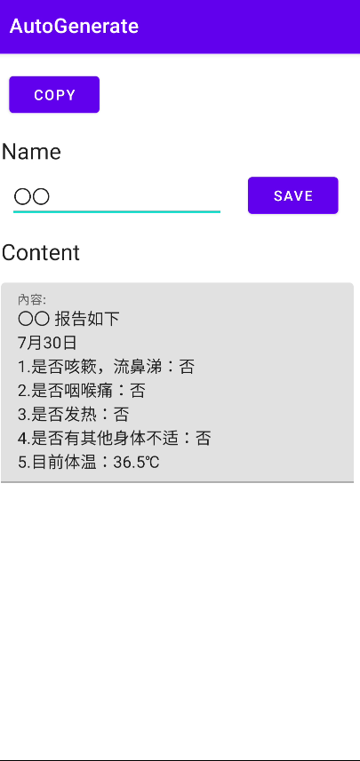

# AutoGenerate

說明:為了能迅速回報每日體溫,且不會複製錯誤.

程式內容:

>Use ClipboardManager 直接複製到剪貼簿
```
  val clipboardManager = getSystemService(Context.CLIPBOARD_SERVICE) as ClipboardManager
            val clipData = ClipData.newPlainText("MyReport",message)
            clipboardManager.setPrimaryClip(clipData)
```


>GetTime 
```
private fun getDate() : String{
        val time = Date()
        val simpleDateFormatter  = SimpleDateFormat("MM月dd日")
        val result = simpleDateFormatter.format(time)
        val stringArray = result.toCharArray()
        var finalResult = ""
        for (i in stringArray.indices) {
            val temp = stringArray[i].toString()
            finalResult += if ( (i==0 || i==3 ) && temp=="0"){ "" }else{ temp }
        }
        return finalResult
    }
```

>SharedPreferences save user name
```
 private fun setSPStringByKey(key : String, value : String) {
        getSharedPreferences("Data", Context.MODE_PRIVATE)
                .edit()
                .putString(key,value)
                .commit()
    }

    private fun getStringFromSP(key : String) : String?{
        return getSharedPreferences("Data", Context.MODE_PRIVATE)
                .getString(key,"")
    }
```

>MainActivity
```
  var name = getStringFromSP("name")
        nameTextView.setText(name)
        saveButton.setOnClickListener {
            setSPStringByKey("name",nameTextView.text.toString())
        }


        copyButton.setOnClickListener {
            val name = nameTextView.text.toString()
            val fever = arrayListOf<Double>(36.3,36.4,36.5,36.6)
            var randomer  = fever[Random.nextInt(fever.size)]
            var message = "$name 报告如下 \n" +
                    "${getDate()} \n" +
                    "1.是否咳簌，流鼻涕：否 \n" +
                    "2.是否咽喉痛：否 \n" +
                    "3.是否发热：否 \n" +
                    "4.是否有其他身体不适：否 \n" +
                    "5.目前体温：$randomer℃"

            val clipboardManager = getSystemService(Context.CLIPBOARD_SERVICE) as ClipboardManager
            val clipData = ClipData.newPlainText("MyReport",message)
            clipboardManager.setPrimaryClip(clipData)
            contentAreaTextView.setText(message)
            Toast.makeText(this@MainActivity,"Copy Done " ,Toast.LENGTH_SHORT).show()
        }

```


# Result

